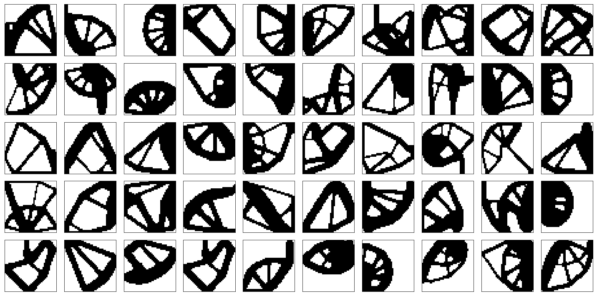
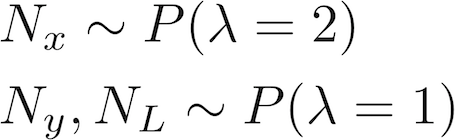
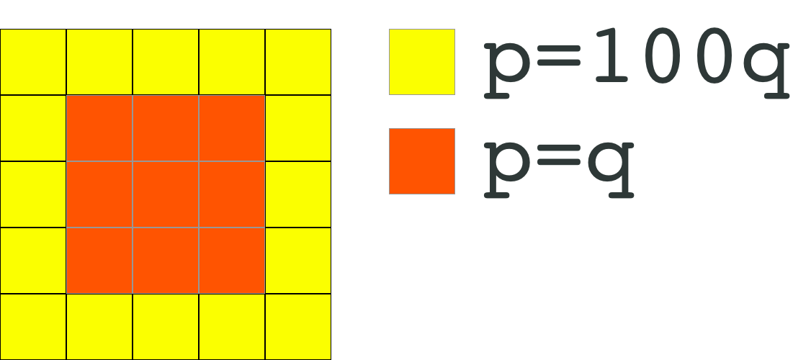

[simp]: http://www.mae.ufl.edu/nkim/egm6365/Solutions/ch10.pdf
[topy]:https://github.com/williamhunter/topy
[url_yandex]:https://yadi.sk/d/1EE7UdYJChIkQQ


# TOP: Topology Optimization Process
Dataset used in "*Neural Networks for Topology Optimization*"
[[link](https://www.degruyter.com/view/j/rnam.2019.34.issue-4/rnam-2019-0018/rnam-2019-0018.xml)][[pdf](https://arxiv.org/pdf/1709.09578.pdf)][[code](https://github.com/ISosnovik/nn4topopt)]

**Download (~3 Gb)** [Yandex Drive][url_yandex] 

The dataset of topology optimization process. It contains the precise solutions of 10,000 randomly stated problems. Each object is a tensor of shape `(100, 40, 40)`: 100 iterations, `40×40` grid. 

## How it is generated
We used [Topy][topy] for the generation of the current dataset. It is based on [SIMP][simp] approach. 

The constraints and loads for each of the problem are chosen in the following way:

- The number of nodes with fixed ***x*** and ***y*** translations and the number of loads are sampled from the Poisson distribution:
<div align="center">
    
</div>


- The nodes for each of the above described constraints are sampled from the distribution defined on the grid. The probability to choose the boundary node is 100 times higher than that for inner node.

<div align="center">
    
</div>


- The load values are chosen as **-1**
- The volume fraction is sampled from the Gaussian distribution with mean of 0.5 and std of 0.1

You can generate your own dataset just by using scripts from `code/` folder. `sampler.py` defines all the required distributions, and `generate_data.py` is just a convenient wrapper for ***ToPy***. Install [ToPy][ToPy] and run:

```
python code/generate_data.py --dir DIR_TO_SAVE --num NUMBER_OF_SAMPLES
```

## How to use
Each tensor is stored in compressed format `.npz`. It could be extracted easily with ***numpy***:

```python
import numpy as np

data = np.load(PATH_TO_FILE)['arr_0']
```

We recommend to use horizontal and vertical flips as well as `90°` rotation to augment the initial dataset. These operations allow one to get the dataset of 80,000 objects.

## Citation
Please cite our work if you write a scientific paper using this code and/or dataset.

```latex
@article{sosnovik2017neural,
  title={Neural networks for topology optimization},
  author={Sosnovik, Ivan and Oseledets, Ivan},
  journal={arXiv preprint arXiv:1709.09578},
  year={2017}
}
```


